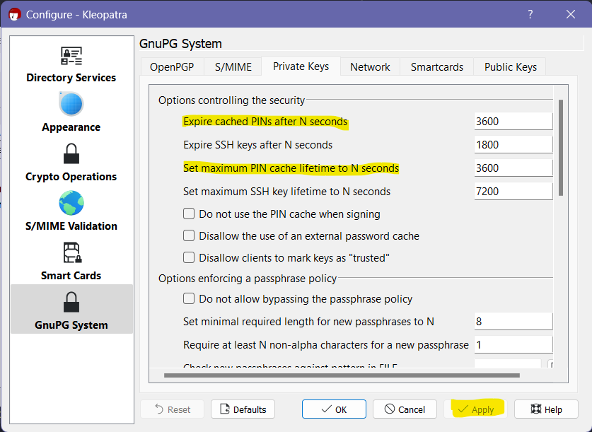

# Some useful gpg commands

First thing first, you need to install a gpg tool to sing your artifacts,
you can download this tool from [gnupg.org](https://gnupg.org/download/index.html)
or use my offline copy [gpg4win-4.0.3.exe](../assets/binaries/gpg4win-4.0.3.exe)

Once installation is complete, open your terminal and follow below commands

### 1) Verify you gpg installation by checking gpg version:

💡 while generating key, you need to provide a password, keep it secret and remember it.

```
gpg --version
```

```
C:\Users>gpg --version
gpg (GnuPG) 2.2.28
libgcrypt 1.8.8
Copyright (C) 2021 g10 Code GmbH
License GNU GPL-3.0-or-later <https://gnu.org/licenses/gpl.html>
This is free software: you are free to change and redistribute it.
There is NO WARRANTY, to the extent permitted by law.

Home: C:/Users/<your-name>/AppData/Roaming/gnupg
Supported algorithms:
Pubkey: RSA, ELG, DSA, ECDH, ECDSA, EDDSA
Cipher: IDEA, 3DES, CAST5, BLOWFISH, AES, AES192, AES256, TWOFISH,
        CAMELLIA128, CAMELLIA192, CAMELLIA256
Hash: SHA1, RIPEMD160, SHA256, SHA384, SHA512, SHA224
Compression: Uncompressed, ZIP, ZLIB, BZIP2
```

### 2) Generate a key by using below command:

```
gpg --full-gen-key
```

```
C:\Users>gpg --full-gen-key
gpg (GnuPG) 2.2.28; Copyright (C) 2021 g10 Code GmbH
This is free software: you are free to change and redistribute it.
There is NO WARRANTY, to the extent permitted by law.

Please select what kind of key you want:
   (1) RSA and RSA (default)
   (2) DSA and Elgamal
   (3) DSA (sign only)
   (4) RSA (sign only)
  (14) Existing key from card
Your selection? 1
RSA keys may be between 1024 and 4096 bits long.
What keysize do you want? (3072) 4096
Requested keysize is 4096 bits
Please specify how long the key should be valid.
         0 = key does not expire
      <n>  = key expires in n days
      <n>w = key expires in n weeks
      <n>m = key expires in n months
      <n>y = key expires in n years
Key is valid for? (0) 0
Key does not expire at all
Is this correct? (y/N) y

GnuPG needs to construct a user ID to identify your key.

Real name: John Doe
Email address: john.doe@email.com
Comment:
You selected this USER-ID:
    "John Doe <john.doe@email.com>"

Change (N)ame, (C)omment, (E)mail or (O)kay/(Q)uit? o
We need to generate a lot of random bytes. It is a good idea to perform
some other action (type on the keyboard, move the mouse, utilize the
disks) during the prime generation; this gives the random number
generator a better chance to gain enough entropy.
We need to generate a lot of random bytes. It is a good idea to perform
some other action (type on the keyboard, move the mouse, utilize the
disks) during the prime generation; this gives the random number
generator a better chance to gain enough entropy.
gpg: key CE7E2E853D3C5327 marked as ultimately trusted
gpg: revocation certificate stored as 'C:/Users/yourname/AppData/Roaming/gnupg/openpgp-revocs.d\7W1S1S7SDSSS73S4DDFD4D5DCD7D2D8D3DDC5D2D.rev'
public and secret key created and signed.

pub   rsa4096 2022-09-07 [SC]
      7W1S1S7SDSSS73S4DDFD4D5DCD7D2D8D3DDC5D2D
uid                      John Doe <john.doe@email.com>
sub   rsa4096 2022-09-07 [E]
```

### 3) Publish key

Once the keys are created, you need to sync the public keys with popular gpg key servers. You can synchronize the keys
by retrieving the public key and then sending it to the
key-servers.

```
gpg --list-keys
```

```
C:\Users>gpg --list-keys
gpg: checking the trustdb
gpg: marginals needed: 3  completes needed: 1  trust model: pgp
gpg: depth: 0  valid:   3  signed:   0  trust: 0-, 0q, 0n, 0m, 0f, 3u
C:/Users/yourname/AppData/Roaming/gnupg/pubring.kbx
-------------------------------------------------
pub   rsa4096 2022-09-07 [SC]
      7W1S1S7SDSSS73S4DDFD4D5DCD7D2D8D3DDC5D2D
uid           [ultimate] John Doe <john.doe@email.com>
sub   rsa4096 2022-09-07 [E]
```

and we will distribute our Public Key it to public server

```
gpg --keyserver https://pgp.mit.edu --send-keys <YOUR-KEY>
```

```
C:\Users>gpg --keyserver https://pgp.mit.edu --send-keys 7W1S1S7SDSSS73S4DDFD4D5DCD7D2D8D3DDC5D2D
gpg: sending key CS7E2SS53S3CSS2E to https://pgp.mit.edu
```

**Some popular key servers**  
[https://pgp.key-server.io](https://pgp.key-server.io)  
[https://keyserver.ubuntu.com](https://keyserver.ubuntu.com)  
[https://pgp.mit.edu](https://pgp.mit.edu)  
[http://keys.gnupg.net](http://keys.gnupg.net)  
[https://keys.openpgp.org](https://keys.openpgp.org)

You can read more detailed instructions
on [the sonatype page on pgp signatures](https://central.sonatype.org/publish/requirements/gpg/).

---

### 4) Export private/public key

#### Export private key

```
gpg --export-secret-keys 7W1S1S7SDSSS73S4DDFD4D5DCD7D2D8D3DDC5D2D > private.key
```

#### Display private key

```
gpg --list-secret-keys --keyid-format=long
```

#### Export public key

add `-a` switch in above command to export public key

```
gpg --export -a B29E44414D3DAF21C518F3F3785620A27BAD3D80 > public2.txt
```

#### Export private key

```
gpg --export-secret-keys -a 7W1S1S7SDSSS73S4DDFD4D5DCD7D2D8D3DDC5D2D > private.txt
```

Prints the GPG key ID, in ASCII armor format.  
Copy your GPG key, beginning
with `-----BEGIN PGP PUBLIC KEY BLOCK----- and ending with -----END PGP PUBLIC KEY BLOCK-----`.

---

### 5) Increase cache time for gpg passphrase

open file below file and change cache values:  
💡 don't forget to backup just in case.

linux: `user-home/.gnupg/gpg-agent.conf`  
windows: `C:\Users\user\Appdata\Roaming\gnupg\gpg-agent.conf`

```
default-cache-ttl 86400
maximum-cache-ttl 86400
```

and Reload gpg-agent using

```
gpgconf --reload gpg-agent
```

in case reload doesn't work

```
gpgconf --kill gpg-agent
```

#### 5.1) Use Kleopatra to change cache time.

The simplest way to change the value with Gpg4win and check that it was really set is by using Kleopatra:  
`Settings -> Configure Kleopatra -> GnuPG System -> Private Keys`

There you can view the settings of and change:  
`expire cached PINs after N seconds`  
`set maximum PIN cache lifetime to N seconds `

  
[stackoverflow-reference](https://stackoverflow.com/a/49422432/7418534)  
